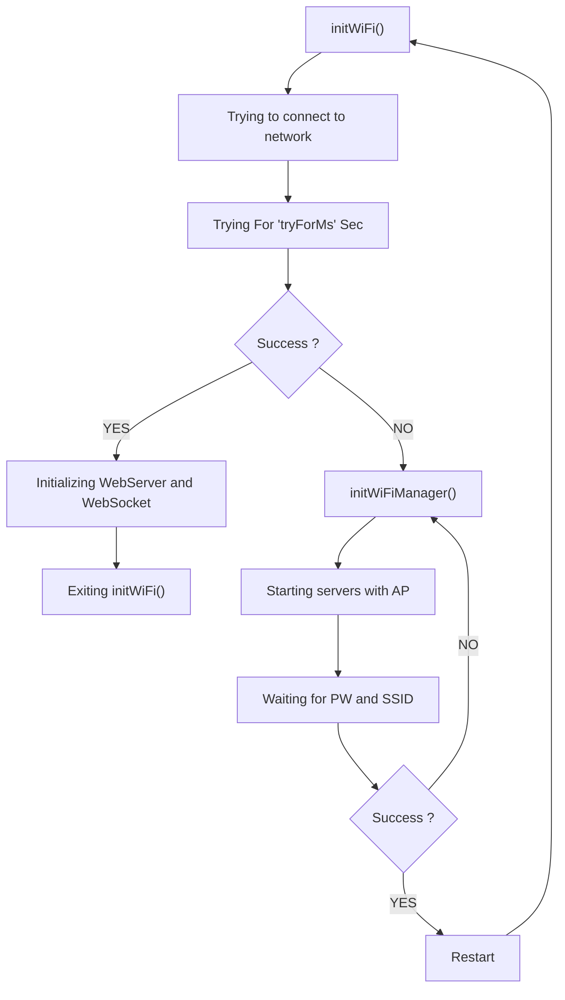
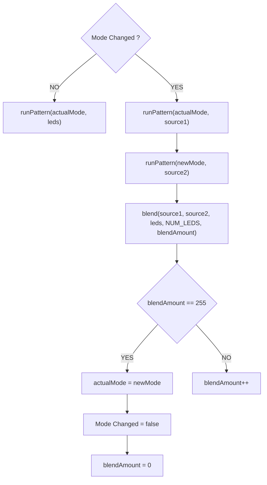

# ESP_IOT_Project


------------------------------------------------------------------------------------------------------------------------------

## Introduction
This is a really simple Open Source WiFi smart lamp repository. This project was built with Espressif ESP32 and WS2812B LEDs controlled by FastLED library.
The main goal was to build a Smart Lamp that you controll with your phone.

- *Feel free to **improve use or fork** this repository in your own projects, just mention me on it :)*
- *For any bugs or improvements feel free to make an [issue](https://github.com/martinvichnal/ESP_IOT_Project/issues) or make a [pull request](https://github.com/martinvichnal/ESP_IOT_Project/pulls)*


------------------------------------------------------------------------------------------------------------------------------


## Table of Contents
- [Introduction](#introduction)
- [Table of Contents](#table-of-contents)
- [Usage](#usage)
	 - [Basic Controls](#basic-controls) 
- [Installation](#installation)
    - [Hardware Requirements](#hardware-requirements)
    - [Software Requirements](#software-requirements)
- [Flow Charts](#flow-charts)
    - [WiFi Manager](#wifi-manager)
    - [Blending](#blending)
- [Mentions](#mentions)

------------------------------------------------------------------------------------------------------------------------------


## Usage
- Connect your LEDs to [this](https://github.com/martinvichnal/ESP_IOT_Project/blob/b9c0bc6115a8d086cfb76bf80369942787a9aea7/src/main.cpp#LL111C42-L111C42)
```C++
#define LED_PIN 5                // Led DATA output
```
- To use this code first you need to set your home WiFi SSID and PASS in the [following code](https://github.com/martinvichnal/ESP_IOT_Project/blob/ecf1069e504b3fa3c4f153a6b806b2fd85c221e6/src/main.cpp#L80):
```C++
// Replace with your network credentials
const char *ssid = "your SSID";
const char *password = "your PASS";
```
- Upload
- When the ESP has connected to your home internet it will put out a message in the serial monitor with the IP adress.
- Copy it then paste it in your web. (Disclaimer! you need to be connected to the same internet as your ESP)

*In further versions you won't have to hard code your credentials.*

### Basic Controls
The lamp has 3 main effects: ***Rainbow***, ***Colors Fade*** and ***Custom Color***.
You can controll the brightness of the leds, in one mode you can controll the hue of the leds and in 2 of the modes you can controll the speed too.


------------------------------------------------------------------------------------------------------------------------------

## Installation

### Hardware Requirements
- Board: ***ESP32***
- Light: ***WS2812B***, 30 LEDs in total
- Power supply: ***18650 battery*** and ***MP2636 charger board***

### Software Requirements
- Operating System: ***ALL***
- Programming environment: ***Visual Studio Code - PlatformIO***
- Programming language: ***C++***
- Additional dependencies or libraries:
```C++
#include <Arduino.h>
#include <WiFi.h>
#include <DNSServer.h>
#include <AsyncTCP.h>
#include <ESPAsyncWebServer.h>
// https://community.platformio.org/t/solved-asyncelegantota-collect2-exe-error-ld-returned-1-exit-status/28553
#include <AsyncElegantOTA.h>
#include <ArduinoJson.h>
#include <FastLED.h>
#include "FileSystem.h"
#include "Cipher.h" // For encryption
```

------------------------------------------------------------------------------------------------------------------------------

## Flow Charts

This flow chart section contains main functions for easy understanding.

### WiFi Manager
This fucntion the initWiFi() where the ESP basically manages the wifi connection.
This fucnion is not running in setup() or loop() (so it runs in one of the cores) because then it wouldn't do anything untill you are connected to the internet. This is important because the lamp can be used as a standalone unit (eg. using it withount any internet) just have to put it in some buttons lol


### Blending
Blending fucntion is just a "Nice to have" part of the code. This is blending two led sources when mode change happened.
Little buggy at the moment. issue: #2



------------------------------------------------------------------------------------------------------------------------------

## Mentions
This project would not be here without these repositories so huge thanks :)

[alanswx/ESPAsyncWiFiManager](https://github.com/alanswx/ESPAsyncWiFiManager),
[kurimawxx00/wifi-manager](https://github.com/kurimawxx00/wifi-manager),
[me-no-dev/ESPAsyncWebServer](https://github.com/me-no-dev/ESPAsyncWebServer).
