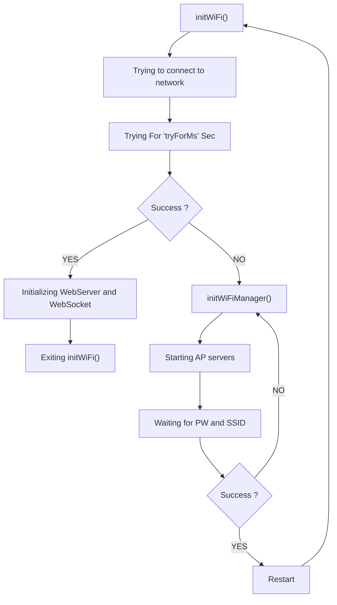

# ESP_IOT_Project
 
# Flow Charts:
This flow chart section contains main functions for easy understanding.

## WiFi Manager

```mermaid
flowchart TD
    initWiFi["initWiFi()"] --> TryToConnectNetwork[Trying to connect to network]
    TryToConnectNetwork --> TryingForSec[Trying For 'tryForMs' Sec]
    TryingForSec --> Success{Success ?}
    Success -->|YES| initServer[Initializing WebServer and WebSocket]
    Success -->|NO| initWifiManager["initWiFiManager()"]

    initServer --> exitInitWifi["Exiting initWiFi()"]

    initWifiManager --> startWebserverWifiManager["Starting AP servers"]
    startWebserverWifiManager --> GettingPWSSID["Waiting for PW and SSID"]
    GettingPWSSID --> SuccessPWSSID{Success ?}
    SuccessPWSSID -->|YES| Restart
    SuccessPWSSID -->|NO| initWifiManager["initWiFiManager()"]

    Restart --> initWiFi
```
